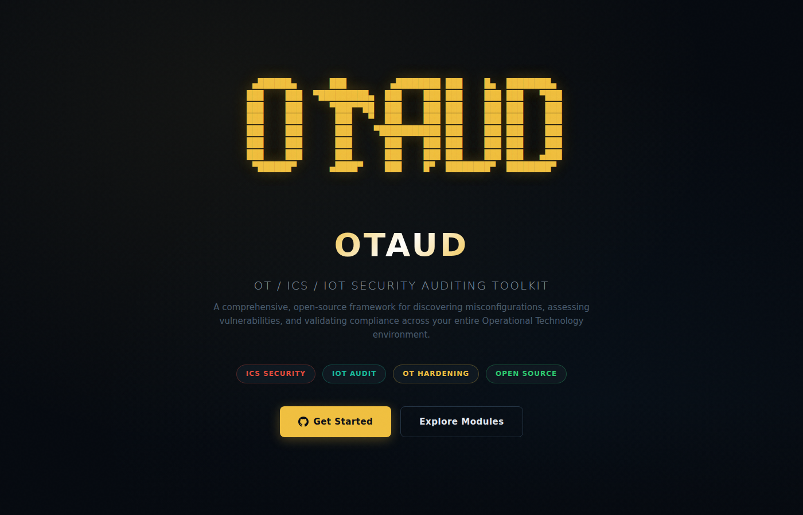
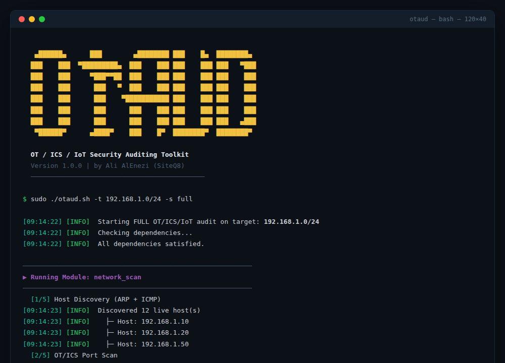
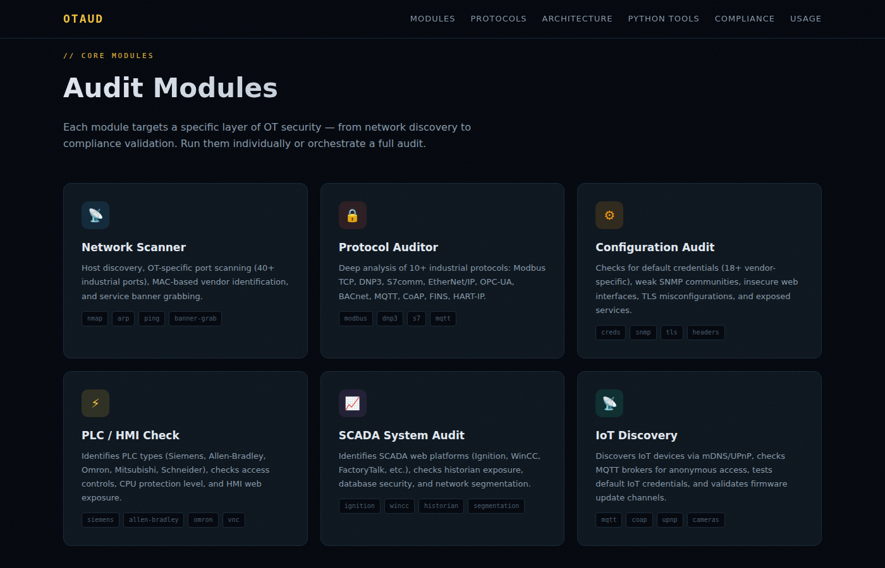
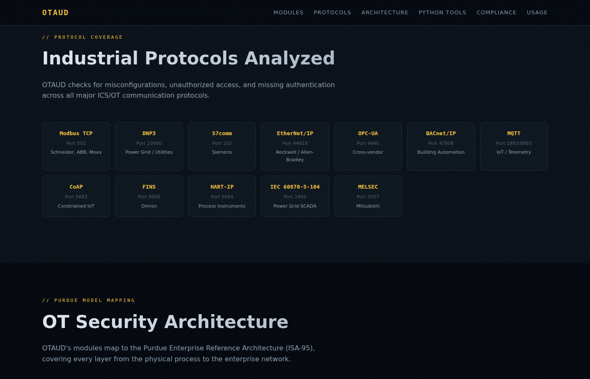
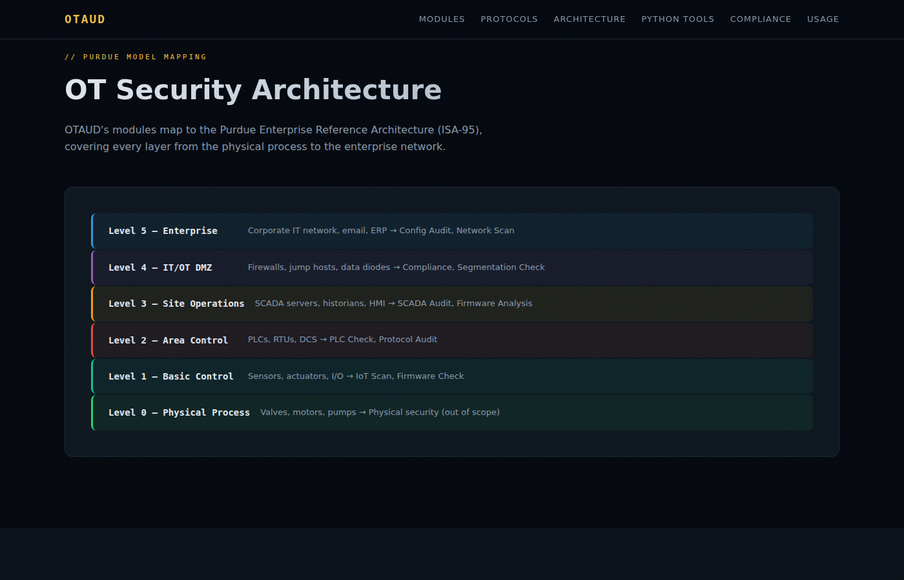
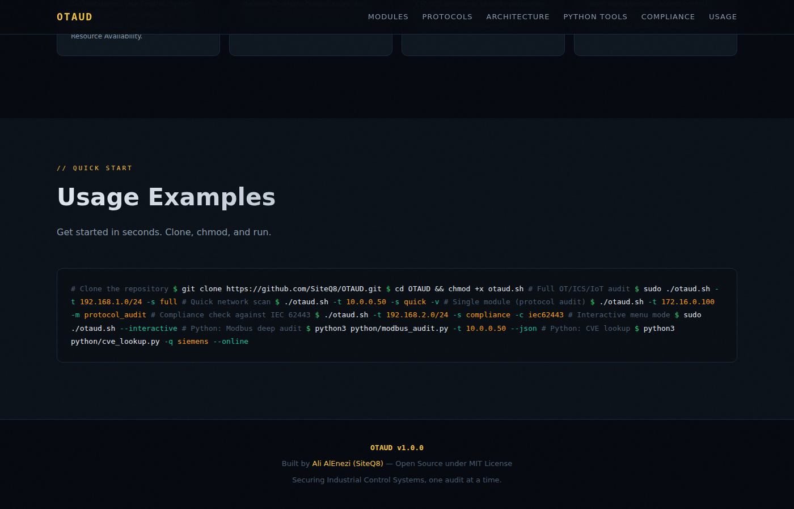

<p align="center">
  
</p>

<h1 align="center">OTAUD</h1>
<h3 align="center">OT / ICS / IoT Security Auditing Toolkit</h3>

<p align="center">
  <a href="#-features"></a>
  <a href="#-protocols"></a>
  <a href="#-python-advanced-modules"></a>
  <a href="#-compliance-standards"></a>
  <a href="LICENSE"></a>
</p>

<p align="center">
  <strong>A comprehensive, all-in-one open-source security auditing framework for Industrial Control Systems (ICS), IoT devices, and Operational Technology (OT) environments.</strong>
</p>

<p align="center">
  OTAUD is designed to check for misconfigurations, unsecured practices, default credentials, protocol-level vulnerabilities, and compliance gaps across your entire OT environment. It is a one-of-a-kind toolkit that has everything you need for ICS, IoT, and OT security — built to help you secure your environment.
</p>

---

## 📸 Screenshots

### Terminal Interface
<p align="center">
  
</p>

### Audit Modules
<p align="center">
  
</p>

### Protocol Coverage
<p align="center">
  
</p>

### Purdue Model Architecture
<p align="center">
  
</p>

### Usage Examples
<p align="center">
  
</p>

---

## 🚀 Quick Start

```bash
# Clone the repository
git clone https://github.com/SiteQ8/OTAUD.git
cd OTAUD

# Make scripts executable
chmod +x otaud.sh modules/*.sh

# Run a full OT/ICS/IoT audit
sudo ./otaud.sh -t 192.168.1.0/24 -s full

# Or launch the interactive menu
sudo ./otaud.sh --interactive
```

---

## ✨ Features

OTAUD includes **8 specialized audit modules**, **6 Python deep-analysis tools**, and **4 compliance standard checks** — covering every layer of the Purdue Enterprise Reference Architecture.

| Module | Description |
|--------|-------------|
| **Network Scanner** | Host discovery, OT port scanning (40+ industrial ports), MAC-based vendor identification, banner grabbing |
| **Protocol Auditor** | Deep analysis of 12+ industrial protocols (Modbus, DNP3, S7comm, EtherNet/IP, OPC-UA, BACnet, MQTT, CoAP, FINS, HART-IP, IEC 104, MELSEC) |
| **Configuration Audit** | Default credential testing (18+ vendor pairs), SNMP community checks, web security headers, TLS validation, FTP/Telnet detection |
| **PLC / HMI Check** | PLC type identification (Siemens, Allen-Bradley, Omron, Mitsubishi, Schneider), CPU protection level, VNC/RDP exposure, program upload checks |
| **SCADA System Audit** | SCADA platform fingerprinting (Ignition, WinCC, FactoryTalk, etc.), historian exposure, database security, network segmentation validation |
| **IoT Discovery** | IoT device enumeration (mDNS/UPnP), MQTT anonymous access, default IoT credentials, firmware update channel security |
| **Firmware Analysis** | Version extraction, CVE matching, debug interface detection, TFTP exposure, bootloader security, unsigned firmware upload |
| **Compliance Checker** | IEC 62443, NIST SP 800-82, NERC CIP v5/v7, ISO 27001 — baseline scoring + framework-specific control checks |

---

## 🔌 Protocols

OTAUD checks for misconfigurations, unauthorized access, and missing authentication across all major ICS/OT communication protocols:

| Protocol | Port | Vendors / Context | Checks Performed |
|----------|------|-------------------|------------------|
| **Modbus TCP** | 502 | Schneider, ABB, Moxa | Unit ID enumeration, function code access, register read |
| **DNP3** | 20000 | Power Grid / Utilities | Secure Authentication status, address enumeration, broadcast response |
| **S7comm** | 102 | Siemens | CPU state query, COTP connection, PUT/GET access |
| **EtherNet/IP** | 44818 | Rockwell / Allen-Bradley | CIP service enumeration, device info |
| **OPC-UA** | 4840 | Cross-vendor | Security policy check, anonymous auth, certificate validation |
| **BACnet/IP** | 47808 | Building Automation | Device info, BACnet SC status |
| **MQTT** | 1883/8883 | IoT / Telemetry | Anonymous access, wildcard subscribe, default creds, TLS |
| **CoAP** | 5683 | Constrained IoT | DTLS enforcement, resource discovery |
| **FINS** | 9600 | Omron | Direct PLC access without authentication |
| **HART-IP** | 5094 | Process Instruments | Network exposure check |
| **IEC 60870-5-104** | 2404 | Power Grid SCADA | Protocol exposure, tunnel requirements |
| **MELSEC** | 5007 | Mitsubishi | PLC accessibility |

---

## 🐍 Python Advanced Modules

For deeper protocol-level analysis, OTAUD includes dedicated Python modules:

```bash
# Modbus TCP deep audit — enumerate, probe, and report
python3 python/modbus_audit.py -t 10.0.0.50 --json

# DNP3 Secure Authentication check
python3 python/dnp3_check.py -t 10.0.0.100

# MQTT broker security audit
python3 python/mqtt_audit.py -t 172.16.0.20 -p 1883

# OPC-UA server security scan
python3 python/opcua_scan.py -t 192.168.1.200

# CVE lookup for OT devices (offline + optional NVD API)
python3 python/cve_lookup.py -q "rockwell" --online

# Generate HTML/JSON audit report
python3 python/report_gen.py -l reports/otaud_*.log -t 192.168.1.0/24 -o report.html
```

---

## 📋 Compliance Standards

OTAUD validates your OT environment against four major industrial cybersecurity frameworks:

| Standard | Coverage |
|----------|----------|
| **IEC 62443** | All 7 Foundational Requirements (FR 1–7): Identification & Authentication, Use Control, System Integrity, Data Confidentiality, Restricted Data Flow, Event Response, Resource Availability |
| **NIST SP 800-82 Rev 3** | Risk management, network architecture, defense-in-depth, ICS firewall rules, recommended hardening controls |
| **NERC CIP v5/v7** | CIP-002 categorization, CIP-005 electronic security perimeters, CIP-007 system security management, CIP-010 configuration change management |
| **ISO 27001** | Annex A controls in OT context: asset management, access control, operations security, communications security, business continuity |

```bash
# Run compliance check against a specific standard
./otaud.sh -t 192.168.1.0/24 -s compliance -c iec62443
./otaud.sh -t 10.0.0.0/16 -s compliance -c nist80082
./otaud.sh -t 172.16.0.0/24 -s compliance -c nerccip
./otaud.sh -t 192.168.2.0/24 -s compliance -c all
```

---

## 📁 Project Structure

```
OTAUD/
├── otaud.sh                    # Main entry point & orchestrator
├── modules/
│   ├── network_scan.sh         # Network discovery & port scanning
│   ├── protocol_audit.sh       # Industrial protocol analysis
│   ├── config_audit.sh         # Configuration & hardening checks
│   ├── plc_check.sh            # PLC/HMI/RTU security assessment
│   ├── scada_audit.sh          # SCADA system security audit
│   ├── iot_scan.sh             # IoT device discovery & audit
│   ├── firmware_check.sh       # Firmware analysis & CVE matching
│   └── compliance.sh           # Compliance standard validation
├── python/
│   ├── modbus_audit.py         # Modbus TCP deep auditor
│   ├── dnp3_check.py           # DNP3 protocol checker
│   ├── mqtt_audit.py           # MQTT broker auditor
│   ├── opcua_scan.py           # OPC-UA security scanner
│   ├── cve_lookup.py           # CVE intelligence lookup
│   └── report_gen.py           # HTML/JSON report generator
├── gui/
│   └── index.html              # Web-based GUI (GitHub Pages)
├── configs/
│   └── default.conf            # Default configuration
├── docs/
│   └── screenshots/            # README screenshots
├── .github/
│   └── workflows/
│       └── ci.yml              # CI pipeline
├── LICENSE                     # MIT License
└── README.md                   # This file
```

---

## 🖥️ Usage

```
OTAUD — OT/ICS/IoT Security Auditing Toolkit v1.0.0
Author: Ali AlEnezi (SiteQ8)

USAGE:
    ./otaud.sh [OPTIONS] -t <target>
    ./otaud.sh --interactive

OPTIONS:
    -t, --target <ip/range>     Target IP address or CIDR range
    -s, --scan <type>           Scan type: full | quick | compliance
    -m, --module <name>         Run a specific module only
    -o, --output <format>       Output: html | json | txt (default: html)
    -c, --compliance <std>      Standard: iec62443 | nist80082 | nerccip | iso27001
    -T, --threads <n>           Thread count (default: 10)
    -v, --verbose               Enable verbose/debug output
    -n, --dry-run               Show what would run without executing
    -i, --interactive           Launch interactive menu
    -h, --help                  Show this help message
    -V, --version               Show version

EXAMPLES:
    ./otaud.sh -t 192.168.1.0/24 -s full
    ./otaud.sh -t 10.0.0.50 -m protocol_audit -v
    ./otaud.sh -t 172.16.0.0/16 -s compliance -c iec62443
    ./otaud.sh --interactive
```

---

## 🔧 Dependencies

**Required:**
- Bash 4.0+
- Python 3.8+

**Recommended (for full functionality):**
- `nmap` — network scanning and NSE scripts
- `curl` — web interface checks
- `openssl` — TLS/SSL analysis
- `jq` — JSON processing
- `dig` — DNS checks
- `snmpwalk` — SNMP auditing
- `netcat (nc)` — banner grabbing

```bash
# Install all dependencies (Debian/Ubuntu)
sudo apt update && sudo apt install -y nmap curl openssl jq dnsutils snmp netcat-openbsd
```

---

## 🌐 Web GUI

OTAUD includes a web-based GUI hosted on GitHub Pages that documents all modules, protocols, architecture mapping, and usage examples:

**🔗 [https://siteq8.github.io/OTAUD/gui/](https://siteq8.github.io/OTAUD/gui/)**

---

## ⚠️ Disclaimer

**OTAUD is designed for authorized security assessments only.** Always obtain proper written authorization before scanning any network or system. Unauthorized scanning of computer systems is illegal in most jurisdictions.

This tool is provided for **defensive security purposes** — to help organizations identify and remediate vulnerabilities in their OT environments before adversaries can exploit them.

---

## 🤝 Contributing

Contributions are welcome! Feel free to:

1. Fork the repository
2. Create a feature branch (`git checkout -b feature/new-module`)
3. Commit your changes (`git commit -m 'Add new module'`)
4. Push to the branch (`git push origin feature/new-module`)
5. Open a Pull Request

---

## 📄 License

This project is licensed under the **MIT License** — see the [LICENSE](LICENSE) file for details.

---

## 👤 Author

**Ali AlEnezi** — [@SiteQ8](https://github.com/SiteQ8)

Built with passion for securing critical infrastructure. 🔒

---

<p align="center">
  <strong>⭐ Star this repo if OTAUD helps secure your OT environment!</strong>
</p>
